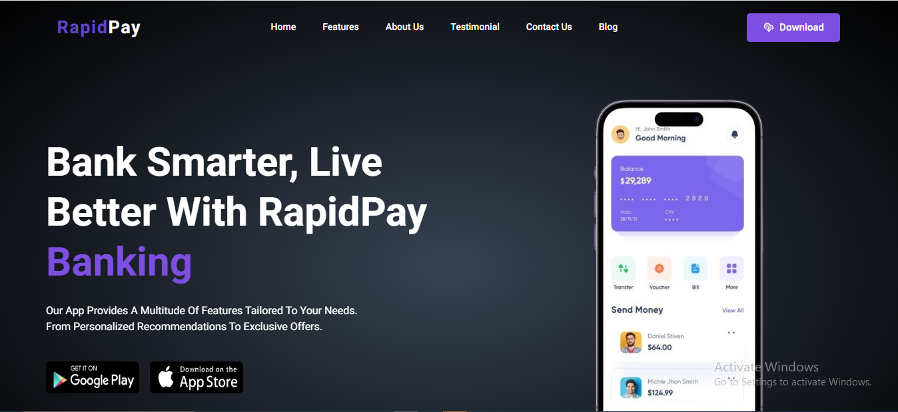

# RapidPay Landing Page Website

A modern, secure, and user-friendly mobile banking application that simplifies financial management by providing seamless access to accounts, transactions, and essential banking services.

## Table of Contents

- [Features](#features)
- [Technologies Used](#technologies-used)
- [Installation](#installation)
- [Screenshots](#screenshots)
- [Contributing](#contributing)
- [License](#license)

---

## Features

- **User Authentication**: Secure login and registration system.
- **Account Management**: View and manage multiple bank accounts.
- **Fund Transfers**: Quick and easy transfers between accounts or to external recipients.
- **Transaction History**: Detailed view of past transactions with filtering options.
- **Budgeting Tools**: Track spending and set financial goals.
- **Mobile-Friendly Design**: Optimized for various screen sizes and devices.

---

## Technologies Used

- **Frontend**:

  - HTML, CSS, JavaScript React,
  - Tailwind CSS / Bootstrap for styling

- **Version Control**:
  - Git and GitHub for source code management

---

## Installation

1. Clone the repository:

   ```bash
   git clone https://github.com/Ebuka-Codes/RapidPay-landing-page.git
   ```

2. Navigate to the project directory:

   ```bash
   cd rapidPay-landing-page
   ```

3. Install dependencies:

   ```bash
   npm install
   ```

4. Run the development server:

   ```bash
   npm run dev
   ```

5. Open the app in your browser at `http://localhost:3000`.

---

## Screenshots

_Add some screenshots of your app here for better visibility. Use the following format:_


_Description: The app's home screen showing account balances and recent transactions._

## Contributing

We welcome contributions to improve the app! Here's how you can help:

1. Fork the repository.
2. Create a new branch (`git checkout -b feature-branch-name`).
3. Make your changes and commit them (`git commit -m "Description of changes"`).
4. Push to the branch (`git push origin feature-branch-name`).
5. Open a pull request.

---

## License

This project is licensed under the [MIT License](LICENSE).

---

## Contact

- **Author**: Ebuka
- **Email**: [ebukanwuba45@gmail.com](mailto:ebukanwuba45@gmail.com)
- **GitHub**: [github.com/Ebuka-Codes](https://github.com/Ebuka-Codes)
